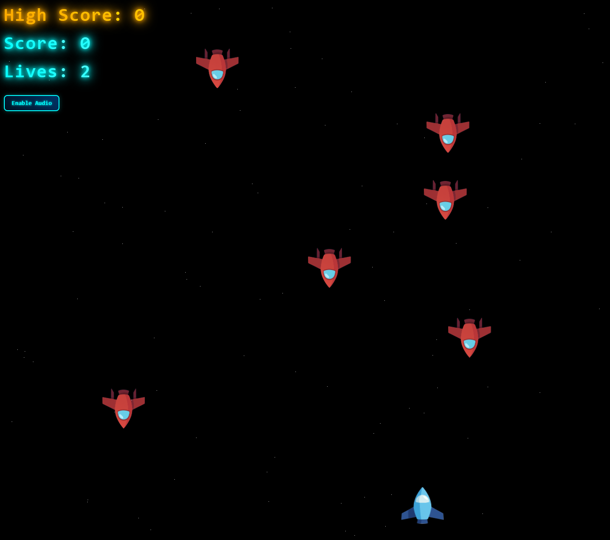

# 🚀 2D Space Shooter



**🎮 [ZAGRAJ TERAZ](https://68c9492c0ed4cc3e874aa217--fanciful-kashata-b61883.netlify.app/)** - Gra dostępna online!

Przeglądarkowa gra 2D typu Space Shooter stworzona w Three.js z Web Audio API.

## 🎮 Opis gry

Steruj futurystycznym statkiem kosmicznym, unikaj wrogów i strzelaj do nich świecącymi pociskami. Zbieraj power-upy dla permanentnego zwiększenia szybkości strzelania!

## 🎯 Mechanika gry

- **Punktacja**: 10 punktów za zniszczenie wroga
- **Życia**: 3 życia na start
- **Power-upy**: Permanentne zwiększenie szybkości strzelania o 20%
- **Wrogowie**: Spadają z góry, częstotliwość rośnie z czasem
- **Trudność**: Progresywnie zwiększa się (1% co sekundę)
- **Kolizje**: Precyzyjne wykrywanie AABB

## 🎵 Dźwięki

- 🔫 Strzał: Wysokie "pew" (800Hz)
- 💥 Eksplozja: Niskie "boom" z echem (150Hz + 100Hz)
- ⚡ Power-up: Melodyjny dźwięk wzrastający (600Hz → 800Hz → 1000Hz)
- 🎛️ **Kontrola audio**: Przycisk Enable/Disable z futurystycznym stylem

## 🚀 Uruchamianie

### 🌐 Online (Polecane)

**[Zagraj w przeglądarce](https://68c9492c0ed4cc3e874aa217--fanciful-kashata-b61883.netlify.app/)** - Gra dostępna na Netlify!

### 💻 Lokalnie

#### Metoda 1: Bezpośrednio

Otwórz `index.html` w przeglądarce

#### Metoda 2: Lokalny serwer

```bash
python3 -m http.server 8000
# lub
npx serve .
```

## 🎮 Sterowanie

| Klawisz         | Funkcja            |
| --------------- | ------------------ |
| WASD / Strzałki | Ruch statku        |
| SPACJA          | Strzał             |
| Enable Audio    | Aktywacja dźwięków |

## 🛠️ Technologie

- **Three.js** - Rendering 3D/2D
- **Web Audio API** - Generowanie dźwięków
- **JavaScript ES6+** - Logika gry
- **HTML5 Canvas** - Wyświetlanie
- **CSS3** - Stylowanie UI

## 📁 Struktura projektu

```
2D-Space-Shooter/
├── index.html         # Główna strona gry
├── game.js            # Logika gry (SpaceShooterGame)
├── style.css          # Futurystyczne stylowanie UI
├── debug.md           # Instrukcje debugowania
├── .gitignore         # Wykluczenia Git
├── img/               # Tekstury obiektów
│   ├── statek-gracza.png
│   ├── enemy_1.png
│   └── powerup.png
├── assets/            # Folder na dodatkowe zasoby
└── README.md          # Ta dokumentacja
```

## 🎨 Obiekty gry

- 🚀 **Gracz**: Sprite z tekstury `statek-gracza.png` (1×1.3)
- 👾 **Wrogowie**: Sprite z tekstury `enemy_1.png` (1×1.4)
- 🔥 **Pociski**: Świecące cylindry z efektem glow (pomarańczowe)
- ⚡ **Power-upy**: Sprite z tekstury `powerup.png` (0.8×1.2)
- ⭐ **Tło**: 1000 białych gwiazd w ruchu

## 🧪 Debugowanie

Otwórz konsolę przeglądarki (F12) i użyj:

```javascript
game.debugCollisions();     // Info o obiektach
game.testPlayerMovement();  // Test granic
game.testShotCooldown();    // Test cooldownu
```

## 🎮 Funkcjonalności

✅ Pełna mechanika gry z progresywną trudnością  
✅ System kolizji AABB z precyzyjnym wykrywaniem  
✅ Power-upy z permanentnym ulepszaniem (20% za każdy)  
✅ Dźwięki proceduralne z Web Audio API  
✅ Futurystyczny UI z czcionką Orbitron i efektami glow  
✅ Restart bez przeładowania z pełnym resetem stanu  
✅ Funkcje debugowania i testowania  
✅ Tekstury 2D sprite'ów dla wszystkich obiektów  
✅ System audio z kontrolą enable/disable  
✅ Responsywny design z gradientami i animacjami  

## 🚀 Zrealizowane funkcjonalności

✅ **Grafika**: Tekstury PNG dla wszystkich obiektów  
✅ **Audio**: Proceduralne dźwięki z kontrolą  
✅ **Trudność**: Progresywne zwiększanie częstotliwości wrogów  
✅ **Power-upy**: Permanentne ulepszenia szybkości strzelania  
✅ **UI**: Futurystyczny design z Orbitron i efektami  
✅ **Gameplay**: Pełna mechanika z restart i Game Over  

## 🔮 Możliwe rozszerzenia

- High scores w localStorage
- Różne typy broni i wrogów
- Animacje eksplozji i efekty cząsteczkowe
- Multiplayer przez WebRTC
- Mobilne sterowanie touch
- Poziomy i boss'y

## 📈 Status projektu

**Wersja**: 1.0 - Pełna funkcjonalność  
**TODO**: Wszystkie główne zadania zakończone (✅ 100%)  
**Wdrożenie**: 🌐 [Dostępne online na Netlify](https://68c9492c0ed4cc3e874aa217--fanciful-kashata-b61883.netlify.app/)  
**Ostatnia aktualizacja**: Dodano high score system i wdrożono na Netlify  

### Zakończone sekcje TODO:

- ✅ Struktura projektu
- ✅ Inicjalizacja Three.js  
- ✅ Gracz z teksturami
- ✅ Strzały z efektami
- ✅ Wrogowie z teksturami
- ✅ Kolizje AABB
- ✅ Punktacja i UI
- ✅ Debugowanie i testy
- ✅ Power-upy z teksturami
- ✅ Dźwięki proceduralne
- ✅ Grafika i tekstury
- ✅ System audio
- ✅ Organizacja projektu

## 📄 Licencja

Projekt edukacyjny - MIT