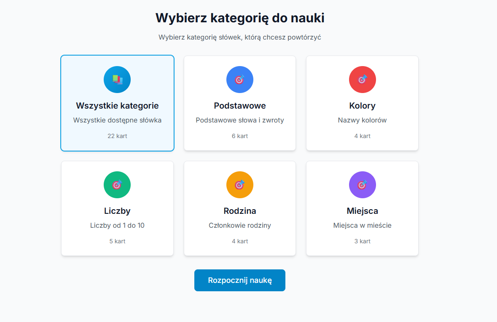

# Spanish Flashcards App 🎯

Aplikacja do nauki hiszpańskiego przez fiszki, zbudowana z React, TypeScript i Vite.

## 🚀 Funkcje

- **Interaktywne fiszki** - Kliknij kartę, aby zobaczyć odpowiedź
- **Kategorie słówek** - Organizacja według tematów (podstawowe, kolory, liczby, rodzina, miejsca)
- **System oceniania** - Oznaczaj odpowiedzi jako prawidłowe lub nieprawidłowe
- **Statystyki sesji** - Śledź postęp i dokładność
- **Responsywny design** - Działa na wszystkich urządzeniach
- **Lokalne przechowywanie** - Dane zapisywane w przeglądarce

## 🛠️ Technologie

- **React 19** - Nowoczesny framework UI
- **TypeScript** - Bezpieczeństwo typów
- **Vite** - Szybki bundler i dev server
- **Tailwind CSS** - Utility-first CSS framework
- **Lucide React** - Ikony
- **Local Storage** - Przechowywanie danych

## 📦 Instalacja

1. Sklonuj repozytorium:

```bash
git clone <repository-url>
cd Vibe_Fiszki
```

2. Zainstaluj zależności:

```bash
npm install
```

3. Uruchom serwer deweloperski:

```bash
npm run dev
```

4. Otwórz przeglądarkę i przejdź do `http://localhost:5173`

## 📸 Podgląd aplikacji



**Interfejs aplikacji - wybór kategorii fiszek do nauki**

## 🎮 Jak używać

1. **Wybierz kategorię** - Na stronie głównej wybierz kategorię słówek do nauki
2. **Rozpocznij naukę** - Kliknij "Rozpocznij naukę"
3. **Przeglądaj fiszki** - Kliknij kartę, aby zobaczyć polskie tłumaczenie
4. **Oceń odpowiedź** - Kliknij "Prawidłowa" lub "Nieprawidłowa"
5. **Zobacz wyniki** - Po ukończeniu sesji zobaczysz statystyki

## 📁 Struktura projektu

```
src/
├── components/          # Komponenty React
│   ├── Flashcard.tsx   # Komponent fiszki
│   ├── Header.tsx      # Nagłówek aplikacji
│   └── CategorySelector.tsx # Selektor kategorii
├── data/               # Dane aplikacji
│   ├── flashcards.ts   # Słownictwo hiszpańskie
│   └── categories.ts   # Kategorie słówek
├── hooks/              # Custom hooks
│   └── useFlashcards.ts # Logika aplikacji
├── types/              # Definicje TypeScript
│   └── index.ts        # Typy aplikacji
├── utils/              # Funkcje pomocnicze
│   └── cn.ts          # Utility do klas CSS
└── App.tsx            # Główny komponent
```

## 🎨 Kategorie słówek

- **Podstawowe** - Często używane słowa i zwroty
- **Kolory** - Nazwy kolorów
- **Liczby** - Liczby od 1 do 10
- **Rodzina** - Członkowie rodziny
- **Miejsca** - Miejsca w mieście

## ➕ Dodawanie własnych fiszek

Aby dodać własne fiszki do aplikacji, edytuj plik `src/data/flashcards.ts`:

### Format fiszki

```typescript
{
  id: 'unikalny-id',           // Unikalny identyfikator
  spanish: 'słowo po hiszpańsku',  // Słowo/zwrot w języku hiszpańskim
  polish: 'tłumaczenie',       // Tłumaczenie na język polski
  category: 'nazwa-kategorii', // ID kategorii (musi istnieć w categories.ts)
  difficulty: 'easy',          // Poziom trudności: 'easy', 'medium', 'hard'
  createdAt: new Date(),       // Data utworzenia
  reviewCount: 0,              // Liczba powtórzeń (zaczyna od 0)
  correctCount: 0,             // Liczba poprawnych odpowiedzi (zaczyna od 0)
}
```

### Przykład dodania nowej fiszki

```typescript
// W pliku src/data/flashcards.ts
export const initialFlashcards: Flashcard[] = [
  // ... istniejące fiszki ...

  // Nowa fiszka
  {
    id: '23',
    spanish: 'buenos días',
    polish: 'dzień dobry',
    category: 'podstawowe',
    difficulty: 'easy',
    createdAt: new Date(),
    reviewCount: 0,
    correctCount: 0,
  },
]
```

### Dodawanie nowej kategorii

Aby dodać nową kategorię, edytuj plik `src/data/categories.ts`:

```typescript
// W pliku src/data/categories.ts
export const categories: Category[] = [
  // ... istniejące kategorie ...

  // Nowa kategoria
  {
    id: 'zwierzeta',
    name: 'Zwierzęta',
    description: 'Nazwy zwierząt',
    color: '#10B981',
    cardCount: 5, // Liczba fiszek w tej kategorii
  },
]
```

### Dostępne kategorie

- `podstawowe` - Podstawowe słowa i zwroty
- `kolory` - Nazwy kolorów
- `liczby` - Liczby od 1 do 10
- `rodzina` - Członkowie rodziny
- `miejsca` - Miejsca w mieście

**💡 Wskazówka:** Po dodaniu nowych fiszek, zrestartuj serwer deweloperski (`npm run dev`) aby zobaczyć zmiany.

## 🔧 Dostępne skrypty

- `npm run dev` - Uruchom serwer deweloperski
- `npm run build` - Zbuduj aplikację do produkcji
- `npm run preview` - Podgląd zbudowanej aplikacji
- `npm run lint` - Sprawdź kod ESLint

## 📱 Responsywność

Aplikacja jest w pełni responsywna i działa na:

- Komputerach stacjonarnych
- Tabletach
- Telefonach komórkowych

## 🚀 Deployment

### Wersja Live

Aplikacja jest dostępna online na: **<https://vibe-fiszki-uxtfh9kf5-fiszki-vibes-projects.vercel.app>**

### Lokalny Build

Aby zbudować aplikację do produkcji:

```bash
npm run build
```

Pliki zostaną wygenerowane w folderze `dist/`, które można wdrożyć na dowolnym serwerze statycznym.

**✅ Naprawione problemy z buildem:**

- Usunięto konfliktujące style CSS z `App.css`
- Dodano konfigurację `base: './'` w `vite.config.ts` dla poprawnego ładowania zasobów
- Aplikacja teraz poprawnie wyświetla się po zbudowaniu

### Uruchamianie zbudowanej aplikacji

**⚠️ Ważne:** Nie otwieraj pliku `dist/index.html` bezpośrednio w przeglądarce (`file://`), ponieważ może to powodować problemy z ładowaniem zasobów.

**✅ Prawidłowy sposób uruchamiania:**

1. **Zbuduj aplikację:**

   ```bash
   npm run build
   ```

2. **Uruchom serwer preview:**

   ```bash
   npm run preview
   ```

3. **Otwórz w przeglądarce:**
   - Aplikacja będzie dostępna na `http://localhost:4173/`
   - Jeśli port 4173 jest zajęty, Vite automatycznie użyje kolejnego dostępnego portu (np. 4174)
   - Sprawdź terminal, aby zobaczyć dokładny adres URL

**Dlaczego nie `file://`?**

- Przeglądarki blokują ładowanie modułów ES6 z lokalnych plików (polityka CORS)
- Ścieżki względne mogą nie działać poprawnie w kontekście `file://`
- Serwer HTTP zapewnia prawidłowe ładowanie wszystkich zasobów

## 🤝 Wkład w projekt

1. Forkuj repozytorium
2. Utwórz branch dla nowej funkcji (`git checkout -b feature/AmazingFeature`)
3. Commit zmiany (`git commit -m 'Add some AmazingFeature'`)
4. Push do branch (`git push origin feature/AmazingFeature`)
5. Otwórz Pull Request

## 📄 Licencja

Ten projekt jest dostępny na licencji MIT. Zobacz plik `LICENSE` dla szczegółów.
