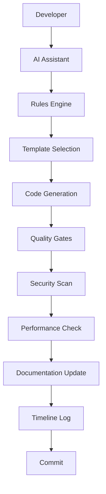
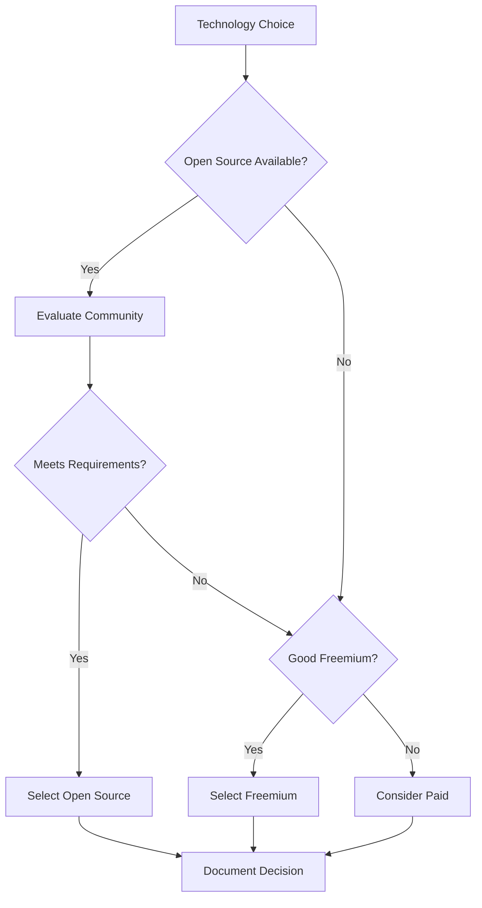

# 🏗️ Architektura - VibeCoding

## 📖 Przegląd architektury

VibeCoding to framework dokumentacyjny i metodologiczny oparty na zasadach modularności, skalowalności i najlepszych praktyk branżowych. Architektura została zaprojektowana z myślą o elastyczności i łatwości rozszerzania.

## 🎯 Zasady architektoniczne

### Core Principles
- **Modularność** - Każdy komponent ma jasno określoną odpowiedzialność
- **Skalowalność** - Architektura wspiera wzrost od MVP do enterprise
- **Bezpieczeństwo** - Security by design w każdej warstwie
- **Wydajność** - Optymalizacja dla szybkiego rozwoju i działania
- **Utrzymywalność** - Kod i dokumentacja łatwe do utrzymania

### Design Patterns
- **Documentation as Code** - Dokumentacja w repozytorium z kodem
- **Convention over Configuration** - Sensowne domyślne ustawienia
- **Separation of Concerns** - Wyraźne granice między komponentami
- **Single Source of Truth** - Jedna autorytarna wersja każdej informacji

## 🏛️ Struktura wysokiego poziomu

```
VibeCoding Framework
├── 📚 Documentation Layer    # Zasady, wytyczne, dokumentacja
├── 🛠️ Tooling Layer         # Narzędzia automatyzacji i CI/CD
├── 📦 Template Layer         # Szablony projektów i konfiguracji
├── 🔍 Quality Layer          # Testy, linting, security scanning
└── 🤖 AI Integration Layer   # Prompty, guidelines dla AI
```

## 📁 Struktura katalogów

### Główna struktura
```
VibeCoding/
├── .amazonq/                 # Konfiguracja AI Assistant
│   └── rules/               # Zasady dla AI
├── docs/                    # Dokumentacja główna
│   ├── README.md           # Główny opis
│   ├── ARCHITECTURE.md     # Ten dokument
│   ├── DEPLOYMENT.md       # Instrukcje wdrożenia
│   └── ...                 # Inne dokumenty
├── templates/               # Szablony projektów
│   ├── web-app/            # Template aplikacji web
│   ├── api-service/        # Template API service
│   └── mobile-app/         # Template aplikacji mobile
├── tools/                   # Narzędzia automatyzacji
│   ├── scripts/            # Skrypty pomocnicze
│   ├── ci-cd/              # Konfiguracje CI/CD
│   └── security/           # Narzędzia bezpieczeństwa
├── examples/                # Przykłady implementacji
│   ├── basic-setup/        # Podstawowa konfiguracja
│   └── advanced-config/    # Zaawansowana konfiguracja
└── tests/                   # Testy frameworka
    ├── unit/               # Testy jednostkowe
    ├── integration/        # Testy integracyjne
    └── e2e/                # Testy end-to-end
```

### Dokumentacja (docs/)
```
docs/
├── README.md               # Główny opis projektu
├── LICENSE                 # Licencja MIT
├── CONTRIBUTING.md         # Zasady współpracy
├── CODE_OF_CONDUCT.md      # Kodeks postępowania
├── SECURITY.md             # Polityka bezpieczeństwa
├── CHANGELOG.md            # Historia zmian
├── ISSUE_TEMPLATE.md       # Szablon zgłoszeń
├── PRD.md                  # Wymagania produktowe
├── ARCHITECTURE.md         # Architektura (ten plik)
├── DEPLOYMENT.md           # Instrukcje wdrożenia
├── TESTS.md                # Dokumentacja testów
├── MVP.md                  # Definicja MVP
├── ROADMAP.md              # Plan rozwoju
└── ACCESSIBILITY.md        # Wytyczne dostępności
```

## 🔄 Przepływ danych

### Development Workflow


### Decision Flow


## 🧩 Komponenty systemu

### 1. Documentation Layer

**Odpowiedzialność**: Przechowywanie i zarządzanie dokumentacją

**Komponenty**:
- Rules Engine - Zasady rozwoju i wytyczne
- Template Documentation - Opisy szablonów
- API Documentation - Specyfikacje interfejsów
- Architecture Decision Records (ADR)

**Technologie**: Markdown, GitHub Pages, MkDocs

### 2. Tooling Layer

**Odpowiedzialność**: Automatyzacja procesów rozwoju

**Komponenty**:
- CI/CD Pipeline - Automatyzacja buildów i deploymentów
- Quality Gates - Automatyczne sprawdzanie jakości
- Security Scanner - Skanowanie vulnerabilities
- Performance Monitor - Monitoring wydajności

**Technologie**: GitHub Actions, SonarQube, Snyk, Lighthouse

### 3. Template Layer

**Odpowiedzialność**: Dostarczanie gotowych szablonów

**Komponenty**:
- Project Templates - Szablony całych projektów
- Configuration Templates - Szablony konfiguracji
- Code Snippets - Fragmenty kodu
- Boilerplate Generator - Generator kodu startowego

**Technologie**: Yeoman, Cookiecutter, JSON Schema

### 4. Quality Layer

**Odpowiedzialność**: Zapewnienie jakości kodu

**Komponenty**:
- Test Framework - Framework testowy
- Linting Rules - Reguły formatowania
- Code Coverage - Pokrycie testami
- Performance Benchmarks - Benchmarki wydajności

**Technologie**: Jest, ESLint, Prettier, k6

### 5. AI Integration Layer

**Odpowiedzialność**: Integracja z narzędziami AI

**Komponenty**:
- Prompt Templates - Szablony promptów
- AI Guidelines - Wytyczne dla AI
- Code Review Assistant - Asystent code review
- Documentation Generator - Generator dokumentacji

**Technologie**: Amazon Q, GitHub Copilot, OpenAI API

## 🔐 Bezpieczeństwo

### Security Architecture

```
┌─────────────────────────────────────────┐
│              Security Layer              │
├─────────────────────────────────────────┤
│ • Input Validation                      │
│ • Output Encoding                       │
│ • Authentication & Authorization        │
│ • Secure Communication (HTTPS/TLS)      │
│ • Security Headers                      │
│ • Rate Limiting                         │
│ • Secrets Management                    │
│ • Dependency Security                   │
│ • OWASP Compliance                      │
│ • Security Testing (SAST/DAST)          │
└─────────────────────────────────────────┘
```

### Security Controls
- **SAST** - Static Application Security Testing
- **DAST** - Dynamic Application Security Testing
- **SCA** - Software Composition Analysis
- **Secrets Detection** - Wykrywanie wycieków sekretów
- **Vulnerability Management** - Zarządzanie lukami
- **Security Monitoring** - Monitorowanie bezpieczeństwa

## ⚡ Wydajność

### Performance Architecture

**Frontend Performance**:
- Core Web Vitals compliance (LCP < 2.5s, FID < 100ms, CLS < 0.1)
- Resource optimization (minification, compression)
- Lazy loading i code splitting
- CDN usage dla statycznych zasobów

**Backend Performance**:
- Database optimization (indeksy, query optimization)
- Caching strategies (Redis, CDN)
- Load balancing i horizontal scaling
- Memory management i garbage collection

**Monitoring**:
- Real User Monitoring (RUM)
- Application Performance Monitoring (APM)
- Infrastructure monitoring
- Error tracking i alerting

## 🧪 Testowanie

### Test Architecture

```
┌─────────────────────────────────────────┐
│              Test Pyramid               │
├─────────────────────────────────────────┤
│                   E2E                   │ ← Mało, drogie
├─────────────────────────────────────────┤
│              Integration                │ ← Średnio
├─────────────────────────────────────────┤
│                 Unit                    │ ← Dużo, tanie
└─────────────────────────────────────────┘
```

**Typy testów**:
- **Unit Tests** - Testy jednostkowe (80% coverage)
- **Integration Tests** - Testy integracyjne
- **E2E Tests** - Testy end-to-end
- **Performance Tests** - Testy wydajności
- **Security Tests** - Testy bezpieczeństwa
- **Accessibility Tests** - Testy dostępności

## 🚀 Deployment

### Deployment Architecture

```
Development → Staging → Production
     ↓           ↓          ↓
   Testing    UAT       Monitoring
     ↓           ↓          ↓
  Code Review  Security   Alerting
     ↓           ↓          ↓
   Quality    Performance  Backup
```

**Environments**:
- **Development** - Lokalne środowisko deweloperskie
- **Staging** - Środowisko testowe
- **Production** - Środowisko produkcyjne

**Deployment Strategies**:
- **Blue-Green Deployment** - Zero-downtime deployments
- **Canary Releases** - Stopniowe wdrażanie
- **Feature Flags** - Kontrolowane włączanie funkcji
- **Rollback Strategy** - Szybki powrót do poprzedniej wersji

## 📊 Monitoring i observability

### Observability Stack

**Metrics**:
- Application metrics (response time, throughput)
- Infrastructure metrics (CPU, memory, disk)
- Business metrics (user engagement, conversion)

**Logging**:
- Structured logging (JSON format)
- Centralized log aggregation
- Log retention policies
- Security event logging

**Tracing**:
- Distributed tracing
- Request flow visualization
- Performance bottleneck identification
- Error correlation

**Alerting**:
- Proactive alerting rules
- Escalation policies
- On-call rotation
- Incident response procedures

## 🔄 Ewolucja architektury

### Aktualne ograniczenia
- Brak automatyzacji niektórych procesów
- Ograniczona integracja z narzędziami AI
- Brak zaawansowanych metryk biznesowych

### Planowane ulepszenia
- **v1.1**: AI-powered code review
- **v1.2**: Advanced analytics dashboard
- **v1.3**: Multi-cloud deployment support
- **v2.0**: Microservices architecture

### Migration Strategy
- Backward compatibility dla wszystkich zmian
- Stopniowa migracja komponentów
- Comprehensive testing przed wdrożeniem
- Rollback plan dla każdej zmiany

---

**Dokument żywy**: Ta architektura będzie ewoluować wraz z rozwojem projektu i zmianami w wymaganiach.